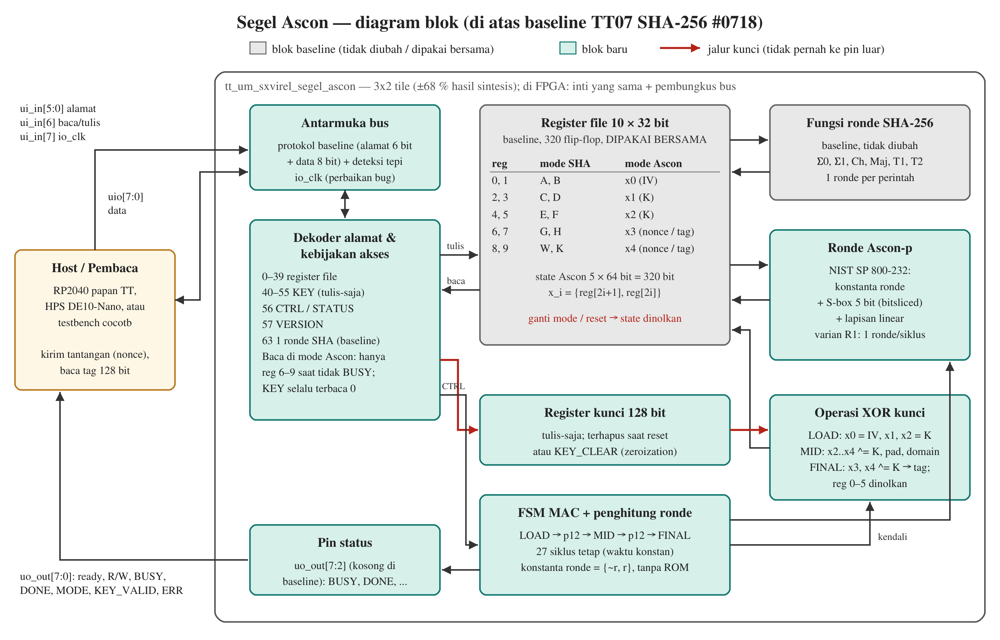

# Segel Ascon

**Inti autentikasi ringan NIST SP 800-232 yang berbagi register dengan SHA-256 Tiny Tapeout 07, untuk label anti-pemalsuan.**

Peruri Chip Hackathon 2026 · Tema 02: Hardware Cryptography Accelerator · Tim: kataahmadnamatimnyainsightcrew

[](https://github.com/SxVirel/segel-ascon/actions/workflows/segel-ascon.yaml)

## Ringkasan

Segel Ascon menambahkan MAC Ascon-AEAD128 (NIST SP 800-232, 2025) ke baseline TT07 SHA-256 ([#0718, xeniarose/tt07-sha256](https://github.com/xeniarose/tt07-sha256)). State Ascon berukuran 320 bit, sama dengan register file baseline 10 × 32 bit, sehingga Ascon memakai register yang sudah ada. Pembaca mengirim tantangan 16 byte, lalu chip menjawab dengan tag 128 bit yang hanya bisa dibuat pemegang kunci. Kunci tidak pernah bisa dibaca dari luar chip, dan mode SHA-256 lama tetap berjalan dengan protokol yang sama.



## Hasil utama

| Ukuran | Hasil | Cara memperoleh |
|---|---|---|
| Kebenaran MAC | Sama dengan test vector resmi (KAT) Ascon-AEAD128 dan 48 tantangan acak dari pyascon | simulasi RTL |
| Kompatibilitas SHA-256 | 5 test bawaan baseline lulus tanpa diubah; 1.284 siklus bus per blok seperti baseline | simulasi RTL |
| Keamanan logis S1–S7 | Semua lulus (tabel di bawah) | simulasi RTL |
| Latensi | 27 siklus hitung; 97 siklus bus per autentikasi (tulis tantangan + hitung + baca tag) | simulasi RTL |
| Flip-flop | 472 (baseline 329) | sintesis Yosys |
| Luas (SkyWater sky130) | 17.229 GE; ±19.968 GE jika dikalibrasi ke alur resmi TT07 | sintesis Yosys |
| Tile Tiny Tapeout | 3x2, utilisasi ±68 % | estimasi dari sintesis |
| Hemat karena berbagi register | 3.834 GE (18,2 %) dan 320 flip-flop dibanding desain fungsi sama dengan state Ascon terpisah | sintesis Yosys |
| FPGA Cyclone V (DE10-Nano) | 2.192 LUT, 472 flip-flop, 0 block RAM, 0 DSP | sintesis Yosys (`synth_intel_alm`) |

Angka luas dan FPGA adalah estimasi sesudah sintesis, belum hasil place & route atau Quartus. Hasil terbaru dapat dilihat di tab **Actions**.

## Cara kerja

Protokol bus sama dengan baseline: host memasang alamat (`ui_in[5:0]`), arah (`ui_in[6]`, 1 = baca), dan data (`uio[7:0]`), lalu menaikkan `ui_in[7]` (`io_clk`) 1 siklus dan menurunkannya 1 siklus.

| Alamat | Mode SHA (baseline) | Mode Ascon |
|---|---|---|
| 0–23 | register A–F | tulis diabaikan, baca = 0 |
| 24–39 | register G, H, W, K | tantangan (tulis) / tag (baca), hanya saat tidak BUSY |
| 40–55 | kunci 128 bit, tulis-saja | kunci 128 bit, tulis-saja |
| 56 | CTRL (tulis) / STATUS (baca) | sama |
| 57 | VERSION = `0xA1` | sama |
| 63 | 1 ronde SHA-256 | ditolak (ERR) |

CTRL: bit 0 MODE (1 = Ascon), bit 1 START, bit 2 CLEAR, bit 3 KEY_CLEAR. Pin status `uo_out[6:2]` = ERR, KEY_VALID, MODE, DONE, BUSY.

Satu autentikasi:
1. Tulis kunci ke alamat 40–55 (sekali setiap reset).
2. Tulis CTRL = `0x01` (mode Ascon).
3. Tulis tantangan 16 byte ke alamat 24–39.
4. Tulis CTRL = `0x03` (START), lalu tunggu pin DONE.
5. Baca tag 16 byte dari alamat 24–39.

Di dalam chip, FSM menjalankan Ascon-AEAD128 dengan data tambahan dan plaintext kosong. Urutannya LOAD → 12 ronde → MID → 12 ronde → TAG, selalu 27 siklus, dengan 1 ronde Ascon per siklus.

## Security Design

| # | Mekanisme | Melawan |
|---|---|---|
| S1 | Kunci tulis-saja (alamat kunci selalu terbaca 0) | pembacaan kunci |
| S2 | Baca state dikunci di mode Ascon; jendela tag hanya terbaca saat tidak BUSY | kebocoran kunci lewat state |
| S3 | State dihapus saat ganti mode, CLEAR, reset, dan di akhir setiap tag | sisa rahasia |
| S4 | Kunci dihapus saat reset dan KEY_CLEAR | sisa kunci |
| S5 | Waktu konstan: selalu 27 siklus | serangan waktu |
| S6 | Deteksi tepi `io_clk` (baseline mengeksekusi 2 ronde jika `io_clk` ditahan 2 siklus) | bug hitungan ganda |
| S7 | Perintah tidak sah ditolak: START tanpa kunci, ronde SHA di mode Ascon, tulisan saat BUSY | penyalahgunaan antarmuka |

Model referensi (`work/ref/segel_model.py`) menunjukkan bahwa jika register baseline tetap bisa dibaca di mode Ascon, kunci bocor. Karena itu S1–S3 menjadi dasar rancangan. Ketahanan terhadap analisis daya (DPA), fault injection, dan serangan relay **tidak** diklaim.

## Struktur repo

| Folder | Isi |
|---|---|
| `work/rtl/` | `project.v` (top `tt_um_sxvirel_segel_ascon`), `ascon_round.v`, `sha256_round.v` (rumus baseline, tidak diubah) |
| `work/tb/` | Testbench cocotb: uji unit ronde, KAT, tantangan acak, S1–S7, SHA-256 sesudah Ascon, pengukuran siklus |
| `work/ref/` | Model referensi Python, pyascon, dan test vector resmi |
| `work/synth/` | Sintesis Yosys (sky130 dan Cyclone V) dan peringkas hasil |
| `work/tt/` | `info.yaml` dan dokumentasi format Tiny Tapeout 07 |
| `work/baseline-sha256/` | Salinan baseline #0718 beserta test aslinya (Apache-2.0) |
| `.github/workflows/` | Pengujian dan sintesis otomatis; alur GDS Tiny Tapeout (manual) |

## Menjalankan pengujian

Setiap push menjalankan workflow **segel-ascon** di GitHub Actions: model referensi, uji unit, desain lengkap bersama 5 test baseline, desain pembanding, sintesis, dan lint Verilator. Hasilnya bisa diunduh dari bagian *Artifacts*. Workflow **segel-ascon-gds** menjalankan alur GDS resmi Tiny Tapeout 07 dan dijalankan manual lewat *Run workflow*.

Di komputer sendiri (Linux/WSL, `iverilog` dan Python 3.11):

```bash
pip install -r work/tb/requirements.txt
python work/ref/segel_model.py                 # model referensi vs 1.089 KAT
cd work/tb
make -f Makefile.round                         # uji unit satu ronde Ascon
make                                           # desain utama + test baseline SHA-256
make SHARED_STATE=0 MODULE=test_segel          # desain pembanding area
```

## Cara membaca kode

1. `work/rtl/ascon_round.v`: satu ronde Ascon. Urutannya sama dengan `ascon_round()` di `work/ref/segel_model.py`.
2. `work/rtl/project.v`: komentar di atas file memetakan 6 bagian. Bagian terpenting adalah deteksi tepi `io_strobe` (S6), `zeroize` (S3), blok `g_shared` (inti ide berbagi register), dan kebijakan baca `rd_data` (S1, S2).
3. `work/tb/test_segel.py`: setiap test punya docstring berisi hal yang dibuktikan.

## Lisensi dan atribusi

- Kode di repo ini: Apache-2.0 (lihat `LICENSE`).
- Baseline TT07 #0718 "tiny sha256" oleh xenia dragon: Apache-2.0 (`work/baseline-sha256/LICENSE`). Rumus ronde SHA-256 di `work/rtl/sha256_round.v` berasal dari baseline ini.
- pyascon (tim Ascon) dan test vector ascon-c: CC0-1.0.
- Pustaka sel SkyWater sky130 diunduh otomatis saat sintesis dan tidak disertakan di repo ini.

## Rujukan

- NIST SP 800-232, *Ascon-Based Lightweight Cryptography Standards for Constrained Devices*, 2025.
- C. Dobraunig, M. Eichlseder, F. Mendel, M. Schläffer, "Ascon v1.2: Lightweight Authenticated Encryption and Hashing," *Journal of Cryptology*, 2021.
- Tiny Tapeout 7 Datasheet; repo shuttle [TinyTapeout/tinytapeout-07](https://github.com/TinyTapeout/tinytapeout-07).
